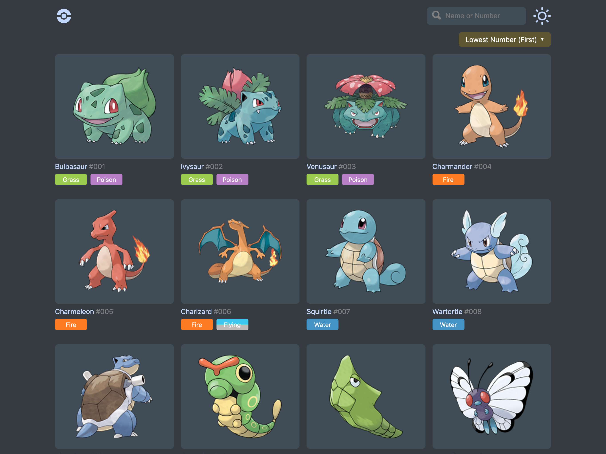

<h1> <a href="https://pokedex.giodelabarrera.vercel.app" alt="Pokédex"> Pokédex</a> </h1>

Single Page Aplication of the characters of the Pokémon series created with React, dark/light mode, mobile first and Clean Architecture consuming data from my own [REST Pokédex API](https://github.com/giodelabarrera/pokedex-api) and compatible with IE11.

[See it online](pokedex.giodelabarrera.vercel.app)️ ↗️

